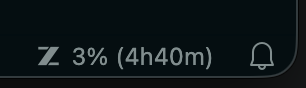

# VSCode z.ai Usage

<!-- markdownlint-disable-next-line -->
### Display your [GLM Coding Plan](https://z.ai/subscribe) usage percentage directly in the VS Code status bar

## Features

- Shows token quota usage (e.g. `45% (2h30m)`) or remaining tokens (e.g. `55% (2h30m)`) in the status bar
- Displays time remaining until quota resets when available
- Automatically refreshes at a configurable interval
- Secure API key storage via VS Code Secret Storage

**Status bar examples:**

|           Situation            |     Display     |
| ------------------------------ | --------------- |
| Authenticated, usage available | `⬡ 45% (2h30m)` |
| Authenticated, no reset time   | `⬡ 45%`         |
| Authenticated, remaining mode  | `⬡ 55% (2h30m)` |
| API key not set                | `⬡ Set API Key` |
| Error / fetch failed           | `⬡ -`           |

> The `⬡` icon is the z.ai icon. Set `zaiUsage.useIcon: false` to display `z.ai:` as a text prefix instead. Set `zaiUsage.displayMode: "remaining"` to show remaining tokens instead of usage.

## Setup

1. Get your API token from the [z.ai API Key page](https://z.ai/manage-apikey/apikey-list)
2. Open the Command Palette (`Cmd+Shift+P` / `Ctrl+Shift+P`)
3. Run **z.ai Usage: Set API Key** and paste your token
4. The status bar will update immediately

## Commands

|           Command           |             Description              |
| --------------------------- | ------------------------------------ |
| `z.ai Usage: Set API Key`   | Enter and verify your z.ai API token |
| `z.ai Usage: Clear API Key` | Remove the stored API token          |

## Settings

|          Setting           |   Type    | Default |                                     Description                                      |
| -------------------------- | --------- | ------- | ------------------------------------------------------------------------------------ |
| `zaiUsage.refreshInterval` | `number`  | `60`    | Data refresh interval in seconds                                                     |
| `zaiUsage.useIcon`         | `boolean` | `true`  | Use z.ai icon (`⬡`) instead of text prefix `z.ai:`                                   |
| `zaiUsage.displayMode`     | `string`  | `usage` | Display mode: `"usage"` (e.g. `75.3%`) or `"remaining"` (e.g. `24.7%`) in status bar |

## Requirements

- VS Code 1.85.0 or higher
- A valid z.ai API token

## License

> [!WARNING]
> This extension uses an internal z.ai API (`api.z.ai/api/monitor/usage/quota/limit`) which is not officially documented. The API may change without notice, which could break this extension.

MIT
